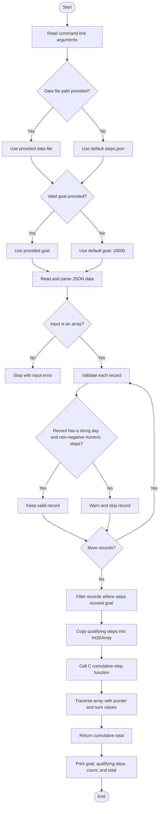

# Step Counter Flowchart

```mermaid
flowchart TD
    A([Start]) --> B[Read command-line arguments]
    B --> C{Data file path provided?}
    C -- Yes --> D[Use provided data file]
    C -- No --> E[Use default steps.json]
    D --> F{Valid goal provided?}
    E --> F
    F -- Yes --> G[Use provided goal]
    F -- No --> H[Use default goal: 10000]
    G --> I[Read and parse JSON data]
    H --> I
    I --> J{Input is an array?}
    J -- No --> K[Stop with input error]
    J -- Yes --> L[Validate each record]
    L --> M{Record has a string day and non-negative numeric steps?}
    M -- Yes --> N[Keep valid record]
    M -- No --> O[Warn and skip record]
    N --> P{More records?}
    O --> P
    P -- Yes --> L
    P -- No --> Q[Filter records where steps exceed goal]
    Q --> R[Copy qualifying steps into Int32Array]
    R --> S[Call C cumulative-step function]
    S --> T[Traverse array with pointer and sum values]
    T --> U[Return cumulative total]
    U --> V[Print goal, qualifying days, count, and total]
    V --> W([End])
```
